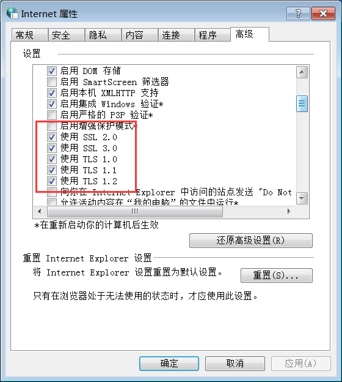

---
next:
    text: '安装前的准备工作'
    link: pre_knowledge
---
# 开始

[AI在线智能问答解答问题[荐]](https://ai.rainysnow.com)

## 软件主要功能介绍与对比

:::details 点我展开

|功能| 桌面版 | X叶 | X助手 |
|:-------:|:-------:|:-------:|:-------:|
|一键登录游戏| ✅ | ❌ |  `◯`(取决于使用平台) |
|绝对秒杀| ✅  | ❌   | ✅   |
|WPE神装| ✅   | ✅    | ❌    |
|自动收集物品| ✅   | ❌    | `◯`    |
|组队挂机| ✅   | ❌    | ✅    |
|全自动批量上号签到,刷图,公会任务| ✅   | ❌    | ❌    |
|自动练级| ✅   | ❌    | ❌    |
|自定义战斗序列| ✅   | ❌    | ❌    |
|秒杀跨服绿巨人| ✅   | ✅    | ❌    |
|兼容各平台|  ❌(暂只兼容4399,QQ空间,3366)   | ✅    | ✅    |
|挂机允许最小化| ❌   | ✅    | ❌    |
|改卡| ✅   | ✅    | ❌    |

本软件无需下载360大厅,Flash中心,免除任何广告烦扰.

:::

~~确保你是Win10以上的系统~~(支持win7,但是要在桌面右键,个性化里面将主题修改为Basic,不能是Aero)

::: details Win7系统请先点我

按win + s,输入Internet选项

<!-- 然后打开所有SSL和TLS即可(若还不行就把1.3也打开). -->

<!--  -->

<!-- **win7系统记得开启 SSL2.0** -->

然后打开所有SSL和TLS.

:::

**遇到文档查找不到或无法解决的问题,请录完整视频,不要只问一句为什么用不了**

**遇到文档查找不到或无法解决的问题,请录完整视频,不要只问一句为什么用不了**

**遇到文档查找不到或无法解决的问题,请录完整视频,不要只问一句为什么用不了**

## 软件视频教程

[点我打开视频教程](https://v.douyin.com/pZo-Mai3uJU/)

[点击开始安装教程](pre_knowledge.html)

[AI在线智能问答解答问题[荐]](https://ai.rainysnow.com)

## 关于美食大战老鼠封号机制的几点说明

首先, 由于网页游戏基于浏览器的设计机制, 无法侦测到你电脑里是否有外挂软件. 美食只能通过你的操作行为来**推测**你有没有开挂(并且这种推测还可能会有误封, [可见该视频](https://www.bilibili.com/video/BV1xRqFBKEmW)), 并不能实锤你是否真的开挂了(只用脚本甚至不用脚本也被封号的也大有人在, 可以侧面印证这一点). 除非你去打那些有排行榜的美食严查的区域. 否则由于玩家基数大, 美食基本不会严查普通的刷图行为, 除了定期清理服务器内的刷子账号(主要是1f, 郊区较少)

## 帮助教程中没有收录你遇到的问题吗?

[点我反馈帮助教程的不足](https://gitcode.com/rainysnow/msdzls-desktop/issues/create?type=markdown&title=%E5%B8%AE%E5%8A%A9%E6%96%87%E6%A1%A3%E5%AE%8C%E5%96%84&template=.gitcode%252FISSUE_TEMPLATE%252FHELPER_REPORT.md)  

没有你想查的问题,请反馈给我.

重复地回答帮助文档中涵盖的问题令人难以接受

## 自动代签到

:::details .

每日凌晨自动代签到,vip签到等 5R/月 联系 2254399813 (答案 msdzls)

:::