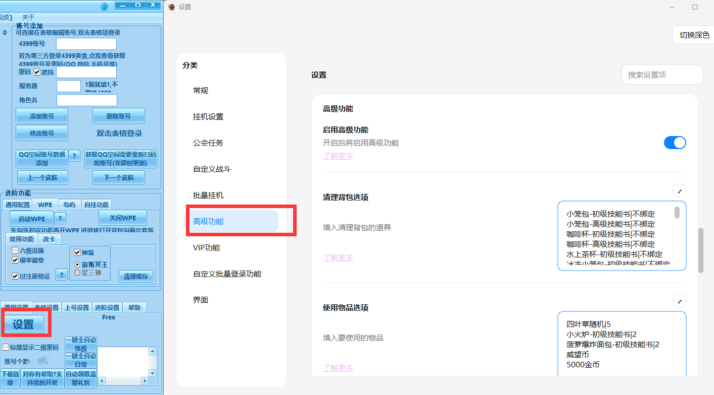

# 高级功能


## 功能视频教程

[一键清理 / 使用物品](https://www.bilibili.com/video/BV1oQbszREzM?p=2)

## 启用

出于兼容性考虑默认不启用

### 0.96.9.40 以上新版本启用方法



### 旧版本启用方法

你可在桌面版主程序右下角的 `进阶设置` 中, 选择`启用高级功能` , 将值填为 真 , 应用配置即可开启. **默认不开启**

**不开启则以下功能均不生效**

详细配置说明见 ↓

**目前仍在测试阶段**

如有BUG[欢迎反馈](https://bug.rainysnow.com)

目前已知问题是有部分用户启用高级功能后, 进入游戏后游戏闪退的情况, 近期会处理.(已在0.96.8.1修复)

如果能正常进入, 但一键清理或使用物品没有反应, 请排查:

0. 需要保证[启用高级功能](#启用)
1. 检查是否使用的官网下载的Flash
2. 重启软件
3. 重启电脑

## 自定义清理背包 一键清理背包

填写示例

```md
麻辣香锅-初级技能书|不绑定
铜食神宝箱菜谱碎片|绑定
```

[点我查看预制的一份清理列表,无需从零开始填写](https://ini-ms.rainysnow.com/old_clean_backpag.ini)

该操作执行时自动完成清理, 可直接打开背包查看清理结果, 清理时也无需打开背包, 可随时一键清理. 其余功能同理.

在自定义战斗操作序列中的格式: **操作=清理背包**

::: warning

请严格按照游戏内的道具名称填写, 否则无法正确识别. 如游戏内技能书名称规则较乱, 初级高级 终极究极

咖啡喷壶的技能书名称为咖啡壶-xx技能书, 而非咖啡喷壶-xx技能书

:::

小技巧:
随着物品数量的增多, 增删改查相关物品会比较难找

可以在列表里自己随意地插入一些分隔符, 分好类, 活动物品删除一遍以后就很少再遇到

```
=====技能书=====
小笼包-高级技能书|不绑定
咖啡杯-初级技能书|不绑定
咖啡杯-高级技能书|不绑定
=====材料=====
玉米淀粉|不绑定
大粒海盐|不绑定
绵白糖|不绑定
研磨瓶|不绑定
=====活动物品=====
多汁水蜜桃|绑定
缤纷桃李|绑定
缤纷水果拼盘|绑定
薄荷青柠酱|绑定
青青粽叶|绑定
```


(若该配置项留空则仍然使用旧版本的背包清理, 设置好该配置项后自动启用新清理背包, 若不行请确认你已设置[开启高级功能](#启用))

## 自定义使用物品 一键使用物品

填写示例

```md
十三香礼包
礼券
威望币|3
5000金币|5
小火炉-初级技能书
```

默认不填数字时一次最大使用20个, 填入则指定最大使用次数(不建议设为很大,会比较卡)

填入礼券, 则会匹配所有的,如 礼券(10D), 礼券(20D) (按照前缀匹配, 所以礼券威望币可以只写前缀, 金币只能写 2000金币 这样子, 以此类推)

该项配置后, 批量日常中的"开十三香礼包"操作将代替为你填写的自定义使用物品操作.

自定义使用物品已加入到[自定义序列](./auto_fight_list.md)中

在自定义战斗操作序列中的格式: **操作=使用物品**

## 免WPE获得爆率徽章

只需要保证[启用高级功能](#启用), 无需额外配置. 

虽然不需要开WPE, 但需要在WPE那边正常勾选爆率徽章 (无成就提醒, 不要误以为没有开启成功, 到背包中找徽章就行)

## 过动态验证

只需要保证[启用高级功能](#启用), 无需额外配置. 

若你发现大部分账号可以过, 仍有少部分账号没有自动过, 可以在各批量窗口中的 "任务事项" -> "执行前执行自定义操作" 中加入 操作=验证, 一般就可以了

## (更新计划) 进游戏后自动后台静默签到领取每日奖励

::: tip 

更多功能不断更新中...

:::