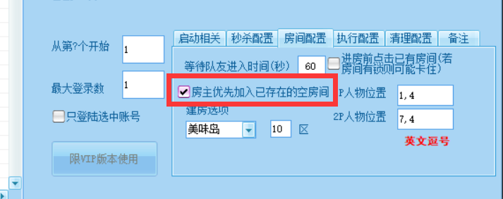

# 自动战斗序列

<!-- ::: info
该功能在0.96.3起支持
:::

::: warning
当前版本的版本的自动战斗,存在一个BUG,可能导致无法组队(两个人单独开房).

需要到 自动公会任务界面勾选  即可 (当然也可以自定义挂机岛屿以及区)

如果这个方法会让你卡在加入房间,那就取消勾选上面的这项,然后在二号玩家的游戏窗口的公会任务界面取消勾选"我是房主号",即可.

这个问题将在0.96.4修复.
::: -->


自动战斗序列适用于自动刷一连串的不同地图,方便地完成日常刷图、悬赏、美食大赛等需要连续挑战不同地图的场景，无需坚守在电脑前手动切换地图。

## 配置

每一行格式如下 (不需要加左侧数字):

```
地图=美味悬赏|秒杀=3000|次数=1|boss=真
地图=火山悬赏|秒杀=3000|次数=1|boss=真
地图=浮空悬赏|秒杀=3000|次数=1|boss=真
地图=星际悬赏|秒杀=3000|次数=1|boss=真
地图=机械鲨鱼鼠|秒杀=0|次数=12|boss=真
地图=水晶宫（精英）|秒杀=0|次数=3|boss=真
地图=茴香竹筏（日）|秒杀=0|次数=40|boss=真
```

除了美食里的地图名称,还支持以下额外的地图名称:

1. 美味悬赏
2. 火山悬赏
3. 浮空悬赏
4. 星际悬赏
5. 智能选择(后续将修复无法选择该地图的问题)

地图名称需严格与map.ini中的地图相同,否则无法正常执行

**直接创建那个关卡,从房间内复制关卡的名字也是可以的,这样方便快捷**

### 修改自定义战斗跳转的岛屿

目前只支持 在桌面版主程序->进阶功能->自挂功能->自动公会任务 界面 右下角, 房间配置 选项卡可以设置相关配置.

未来将会加入到游戏窗口中

## 以下部分功能需要至少更新到0.96.7版本后才能正常使用

### 挂机相关配置

|名称| 示例 | 说明 | 
|:-------:|:-------:|:-------:|
|秒杀| 秒杀=3000 | 设定秒杀间隔为3000毫秒 |
|放卡| 放卡=真 | 选择 脚本放卡而不秒杀 |
|延迟波次| 延迟波次=6 | 脚本放卡而不秒杀,延迟波次为6 |
|延迟秒数| 延迟秒数=300 | 脚本放卡而不秒杀,延迟秒数为300 |
|仅双人| 仅双人=真 | 设置仅双人时开始游戏, 不填时默认不限制 |
|房主| 房主=真 | 动态调整当前账号是否为房主,假如说战斗序列里有只能单人完成的关卡比如水晶宫,这时候就可以设置 房主=真 , 让这个账号成为房主而不是加入其他人的房间 |

### 自定义操作序列

根据ISSUE反馈, 你可以像添加挂机序列那样, 插入操作序列,解放双手

如:
```
操作=使用双爆
操作=爆率徽章
地图=茴香竹筏（日）|秒杀=0|次数=40|boss=真
```

|名称| 说明 | 
|:-------:|:-------:|
|使用双爆| 自动使用两张双爆卡 |
|清理背包| 清理背包物品,暂时只能清理指定的垃圾物品,暂不支持自定义 |
|爆率徽章| 需要提前开启WPE, 之后脚本会自动勾选套装并启用爆率徽章 |
|兑换背包| 自动在假期特惠兑换背包|
|领取悬赏| 领取悬赏奖励|
|每日任务| 领取每日任务奖励|


## 批量自动化-自定义战斗

[目前只支持批量自动签到时执行自定义战斗](/docs/guide/auto_sign.md) ,如果你有好的建议,[欢迎反馈](https://report.rainysnow.com)

### 批量配置自定义战斗

[下载桌面版配置工具](https://rainyy.lanzoul.com/iCtLx3hxnsfa) (访问密码2333) 以后,

打开, 选择软件根目录,

在自定义战斗配置区域填入相关自定义战斗方案

然后到 "批量配置" 界面

"配置名称" 填入：自定义战斗_一键签到时执行

"值" 填入：真

即可.

## 未来计划

未来计划支持更多操作

同样欢迎反馈建议

## 遇到问题?

### 无法继续战斗?

如果你确定已经设置了 boss=真 但还是无法战斗

你可以把那段文本复制到qq发送出去,可以看到他会多了一些空行,把那些空行去掉再复制回去即可.

### 悬赏进入的是旧地图

如果你在周四更新新地图后没有重启过桌面版,需要重启桌面版以获取最新地图信息

如果仍然进入旧地图, 你可以到官网下载最新版本.