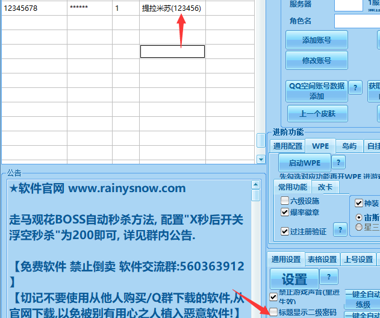

# 自定义战斗序列

<!-- ::: info
该功能在0.96.3起支持
:::

::: warning
当前版本的版本的自动战斗,存在一个BUG,可能导致无法组队(两个人单独开房).

需要到 自动公会任务界面勾选  即可 (当然也可以自定义挂机岛屿以及区)

如果这个方法会让你卡在加入房间,那就取消勾选上面的这项,然后在二号玩家的游戏窗口的公会任务界面取消勾选"我是房主号",即可.

这个问题将在0.96.4修复.
::: -->


::: tip

在浏览器中按快捷键 `CTRL + F`, 然后输你想找的关键词, 可以快速定位相关内容.

在页面内按 `CTRL + K`, 输入相关内容, 可**快速定位本文档内的相关内容**, 且支持模糊搜索

:::


自定义战斗序列适用于自动刷一连串的不同地图,方便地完成日常刷图、勇士、水晶宫、悬赏、美食大赛等需要连续挑战不同地图的场景，无需坚守在电脑前手动切换地图。

功能所在位置: 进入游戏窗口后, 点击右侧的 `日常` 选项卡, 下方即为自定义战斗


## 配置

每一行格式如下 (不需要加左侧数字), 可直接完整复制使用:

**下面打了 // 的并不会执行, 只是演示给大家看**

房主号:

```
仅双人=真
房主=真
//打开一次悬赏界面, 防止拿不到奖励
操作=领取悬赏
地图=美味悬赏|秒杀=3000|次数=1|boss=真
地图=火山悬赏|秒杀=3000|次数=1|boss=真
地图=浮空悬赏|秒杀=3000|次数=1|boss=真
地图=星际悬赏|秒杀=3000|次数=1|boss=真
操作=领取悬赏
地图=茴香竹筏（日）|秒杀=0|次数=40|boss=真
地图=芝士城堡|秒杀=0|次数=5|boss=真|放卡=真|延迟秒数=300
//切换单人运行时按如下方式调整
仅双人=假
房主=真
禁队友位置=真
地图=机械鲨鱼鼠|秒杀=0|次数=12|boss=真
地图=水晶宫（精英）|秒杀=0|次数=3|boss=真
//地图=魔塔蛋糕第1层|秒杀=7000|次数=1|放卡=真|延迟秒数=30
//领取每日任务奖励
操作=每日任务
//关机命令, 按需开启
//操作=系统命令|命令=shutdown -s -t 1
```

成员号:

```
仅双人=真
房主=假
//打开一次悬赏界面, 防止拿不到奖励
操作=领取悬赏
地图=美味悬赏|秒杀=3000|次数=1|boss=真
地图=火山悬赏|秒杀=3000|次数=1|boss=真
地图=浮空悬赏|秒杀=3000|次数=1|boss=真
地图=星际悬赏|秒杀=3000|次数=1|boss=真
操作=领取悬赏
地图=茴香竹筏（日）|秒杀=0|次数=40|boss=真
地图=芝士城堡|秒杀=0|次数=5|boss=真|放卡=真|延迟秒数=300
//切换单人运行时按如下方式调整
仅双人=假
房主=真
禁队友位置=真
地图=机械鲨鱼鼠|秒杀=0|次数=12|boss=真
地图=水晶宫（精英）|秒杀=0|次数=3|boss=真
//地图=魔塔蛋糕第1层|秒杀=7000|次数=1|放卡=真|延迟秒数=30
//领取每日任务奖励
操作=每日任务
//关机命令, 按需开启
//操作=系统命令|命令=shutdown -s -t 1
```

<!-- 这段文本复制到记事本, 再从记事本里复制到对应位置, 一般就可以正常运行了 -->

::: tip

地图名称不要自己输, 因为地图名称需严格与游戏的地图名字相同, 否则无法正常执行

建议你手动创建那个关卡, 从房间内下方复制关卡的名字就可以了, 这样方便快捷

:::

**在两个号分开各自打的时候, 成员号需要插入一条 房主=真, 让成员号自己开房, 否则会等待其他人创建房间**

除了美食里的地图名称,还支持以下额外的地图名称:

1. 美味悬赏
2. 火山悬赏
3. 浮空悬赏
4. 星际悬赏
<!-- 5. 智能选择(后续将修复无法选择该地图的问题) -->

自定义战斗支持挂机魔塔. 从房间内复制关卡的名字即可

## 注释

想临时不执行某些行, 直接在对应行开头加 ; 或 // 即可

## 修改自定义战斗默认跳转的岛屿

::: tip
在 0.96.9.56版本及先前版本存在一个bug, 若没有打过一次地图, 使用跳转岛屿会导致卡在荣誉殿堂, 这个 BUG 将在 0.96.9.57 版本修复
:::

可以通过 [操作=跳转岛屿](./auto_fight_list.md#jump-land) 指定跳转到哪个岛屿

`操作=跳转岛屿|岛屿=美味岛|区=11` 

目前支持的岛屿名称: `美味岛` `火山岛` `浮空岛` `海底` `星际穿越` `探险营地` `沙漠` ` 雪山雷城` `奇境`|

## 挂机相关配置

以下的必须**加在地图=xxx| 后**, 如 `地图=古堡初探|次数=1|boss=真|秒杀=0|猫猫大法=真|延迟波次=3|浮空秒杀开关秒数=200|跨服区号=4` 表示使用猫猫大法, 等待第3波后开始0秒秒杀, 200秒后重复开关浮空秒杀, 并且到跨服四区挂古堡初探地图

|名称| 示例 | 说明 | 
|:-------:|:-------:|:-------:|
|秒杀| 秒杀=3000 | 设定秒杀间隔为3000毫秒 |
|翻牌| 翻牌=3 | 设定翻牌数量为3, 不设置默认为2|
|卡组| 卡组=3 | 设定选择第3个卡组, 不设置默认为1, 若设置为0, 则不选择任何卡组, 选择背包中的前两张卡片 (自0.96.9.30起支持) |
|放卡| 放卡=真 | 选择 脚本放卡 而不秒杀|
|猫猫大法| 猫猫大法=真 | 选择 开启猫猫大法 而不秒杀|
|延迟波次| 延迟波次=6 | 不秒杀,延迟波次为6后开启秒杀 (配合放卡或猫猫大法使用, 否则无效)|
|延迟秒数| 延迟秒数=300 | 不秒杀,延迟秒数为300后开启秒杀  (配合放卡或猫猫大法使用, 否则无效)|
|漫天火苗| 漫天火苗=5 | 选择 漫天火苗, 设置数字代表漫天火苗持续的秒数|
|浮空秒杀开关秒数| 浮空秒杀开关秒数=300 | 设置多少秒后开关浮空秒杀, 这样用于那些特殊BOSS种类较多的关卡, 一次可能无法秒杀所有BOSS, 需要重新开关方可秒杀.|
|跨服区号| 跨服区号=3 | 设置挂机跨服时要跳转到的区号, 去一个人少的区将更容易组队成功 (自0.96.9.34版本起支持)|
|浮空秒杀开启秒数| 浮空秒杀开启秒数=300 | 设置多少秒后开启浮空秒杀, 不设置默认每60秒检测一次浮空秒杀, 可用于浮空关精准定位通关时间(自0.96.9.56版本起支持)|


以下的建议单开一行设置, 更清晰(单开一行后, 若需要关闭对应设置, 则再在需要的地方时候设置一句xxx=假, 否则一直保持对应功能的状态.)

|名称| 示例 | 说明 | 
|:-------:|:-------:|:-------:|
|仅双人| 仅双人=真 | 设置仅双人时开始游戏, 不填时默认不限制 |
|房主| 房主=真 | 动态调整当前账号是否为房主,假如说战斗序列里有只能单人完成的关卡比如水晶宫,这时候就可以设置 房主=真 , 让这个账号成为房主而不是加入其他人的房间 |
|禁队友位置| 禁队友位置=真 | 调整是否禁止队友位置 (自0.96.9.34版本起支持) |
|等待队友进入时间| 等待队友进入时间=0 | 动态调整等待队友进入时间 (自0.96.9.52版本起支持) |


## 自定义操作序列

<!-- 根据ISSUE反馈, 你可以像添加挂机序列那样, 插入操作序列,解放双手 -->

你可以像添加挂机序列那样, 插入操作序列, 进一步解放双手


如:
```
操作=使用双爆
操作=爆率徽章
地图=茴香竹筏（日）|秒杀=0|次数=40|boss=真
```

|名称| 说明 | 
|:-------:|:-------:|
|签到| 由于界面加载慢, 建议执行两遍 操作=签到 避免漏签, VIP签到同理|
|VIP签到|同上|
|使用物品| 若未启用高级功能, 则执行使用十三香礼包, 否则使用[高级功能](./advanced.md)中的"使用物品选项"|
|使用双爆| 自动使用两张双爆卡 |
|清理背包| 清理背包物品, 默认配置下只能清理指定的垃圾物品, 想[自定义点我](./advanced.md#功能视频教程) |
|爆率徽章| 需要提前开启WPE, 之后脚本会自动勾选套装并启用爆率徽章(若已开启[高级功能](./advanced.md), 则无需启用WPE也可以获得爆率徽章) |
|兑换背包| 自动在假期特惠兑换背包|
|分解宝石| 分解背包内的一部分0星不绑宝石|
|每日任务| 领取每日任务奖励|
|领取悬赏| 领取悬赏奖励|
|领取探险营地奖励| 领取探险营地奖励|
|领取美食大赛奖励| 领取美食大赛奖励|
|领取大富翁| 领取大富翁奖励|
|公会任务| 执行公会任务并领取奖励|
|系统命令| 执行系统命令(需至少是0.96.8.6以上版本的桌面版), 如: 操作=系统命令\|命令=shutdown -s -t 1 (表示执行关机指令)|
|<span id="bind-warm-gift">绑定温馨礼包</span>| 操作=绑定温馨礼包 即可,无需其他参数 自动绑定后, 领取链接的末尾是对应游戏的账号_区服号码 如: account_29 (需至少是0.96.9.0以上版本的桌面版)|
|<span id="claim-warm-gift">领取温馨礼包</span>| 自动领取温馨礼包, 若你已在温馨礼包.txt中填入,则无需本条命令, 本命令仅用于自动领取那些通过 操作=绑定温馨礼包 自动绑定得到的账号的温馨礼包. (需至少是0.96.9.0以上版本的桌面版)|
|退出游戏| 退出游戏|
|<span id="jump-land">跳转岛屿</span>| 操作=跳转岛屿\|岛屿=美味岛\|区=11 (目前支持的岛屿名称(需严格相同): `美味岛` `火山岛` `浮空岛` `海底` `星际穿越` `探险营地` `沙漠` ` 雪山雷城` `奇境`, 需至少是0.96.9.31以上版本的桌面版)|
|等待| `操作=等待\|等待时长=3秒` `操作=等待\|等待时间=18:59:30` 指定等待指定时间或等待到指定时刻, 可用于定时执行某些任务(需至少是0.96.9.56以上版本的桌面版)|

### 操作序列兑换假期特惠

自0.96.9.17起支持:

2026年4月18日10:31:19 修正

<!-- 2026年4月18日10:32:40 -->
<!-- 这里需要注意Markdown \- 会被转义成 -,  如果是\- 需要写 \\- 才可以 -->

|名称| 说明 | 
|:-------:|:-------:|
|~~操作=假期特惠兑换\|类型=1\|flag=6bd530,-256\-22\fdfdd9,-210\5\ffffb2,-156\-5\ef8c43~~  <br> 操作=假期特惠兑换\|类型=1\|flag=6bd530,-256\\-22\fdfdd9,-210\5\ffffb2,-156\\-5\ef8c43| 兑换月签到奖励(25签到道具+1星星之火 兑换签到礼包)|
|~~操作=假期特惠兑换\|类型=1\|flag=68d830,-201\-5\ed8d43,-148\-3\ef8c43,-52\-5\abd6cd~~ <br> 操作=假期特惠兑换\|类型=1\|flag=68d830,-201\\-5\ed8d43,-148\\-3\ef8c43,-52\\-5\abd6cd| 兑换公会活跃礼包奖励(20星星之火兑换有8个转转券的礼包)| 兑换公会活跃礼包奖励(20星星之火兑换有8个转转券的礼包)|

### 需要启用高级功能的高级操作

以下操作**必须[启用高级功能](./advanced.md#启用)** 才有效, 如无特别说明, 则至少需是`0.96.9.5`以上版本的桌面版. 请通过背包物品是否变化, 而非是否跳转相关界面, 来判断是否执行成功.

|名称| 说明 | 
|:-------:|:-------:|
|操作=礼券购买物品\|物品名称=樱桃\|数量=2|礼券购买对应物品, 默认购买间隔是200毫秒, 可以通过 `\|间隔=300` 这样来指定间隔 |
|操作=许愿池\|轮数=2| 快速完成许愿池批量抽奖, 无需手动操作. **背包满了不会自动终止, 请自行合理安排抽奖次数**|
|操作=使用指定物品\|物品名称=5000金币| 使用1个指定的物品. 特例情况: 背包中双爆卡的名称为`2小时道具双爆卡`, 但实际需要填写的名称为 `道具双爆卡` 或`道具双爆卡(2小时)`, 这是非常少见的与名称不一致的特例. 2026.7.4注: 似乎老版的双爆卡名称是道具双爆卡(2小时), 但新版双爆卡(可大量堆叠) 名称为 `道具双爆卡` . 在此一并给出其他多倍掉落卡的名称, 供参阅 `双倍经验卡` `道具双爆卡` `道具双爆卡(2小时)` `三倍经验卡(2小时)` `三倍道具卡(2小时)` `五倍经验卡(2小时)` `五倍道具卡(2小时)`|

以下操作**必须[启用高级功能](./advanced.md#启用)** 才有效, 如无特别说明, 则至少需是`0.96.9.50`以上版本的桌面版. 请通过背包物品是否变化, 而非是否跳转相关界面, 来判断是否执行成功.

|名称| 说明 | 
|:-------:|:-------:|
|操作=公会花园浇水| 公会花园浇水|
|操作=公会花园施肥\|次数=3|公会花园施肥|
|操作=领取公会任务奖励|领取公会任务奖励|
|操作=删除邮件\|保留未读=假|删除已提取附件的邮件, 并指定是否保留未读邮件|
|操作=领取新手登录奖励\|天数=10|领取新手登录奖励(有糖果背包的那个)|
|操作=购买魔塔次数\|购买次数=3|礼券购买魔塔次数(需至少是0.96.9.53以上)|
|操作=大富翁投掷\|次数=3|快速投掷指定次数的大富翁骰子(重进一次大富翁后可以看到效果)(需至少是0.96.9.55以上)|
|操作=情侣任务|执行情侣任务(需至少是0.96.9.57以上)|
|操作=领取情侣任务奖励|领取情侣任务奖励(需至少是0.96.9.57以上)|

### 施工中的高级操作(敬请期待)

以下操作将在后续版本中逐步完成, 且需 [启用高级功能](./advanced.md)

```
操作=升级背包|背包类型=道具背包 (支持卡片背包, 道具背包, 暂不支持 "装备背包")
操作=发送邮件|收件人=提拉米苏|附件物品=咖啡壶配方|到期小时=6
操作=领取全部邮件
操作=自定义假期特惠兑换|所需物品1=金币|数量=25000|所需物品2=港口背包|数量=3|兑换物品=火山背包|数量=1
```

## 条件执行

(自0.96.9.23版本起支持)

只在满足条件的时候执行某些操作, 请看下列示例

```
操作=限制执行条件|限制=星期|允许值=4,5,6
操作=签到
操作=执行自定义方案|方案名称=测试方案
地图=xxx
操作=限制结束

操作=限制执行条件|限制=日期|允许值=25,26
操作=兑换背包
操作=限制结束
```

## 自定义方案 (★推荐使用)

(自0.96.9.23版本起支持)

`操作=执行自定义方案|方案名称=测试方案`


且支持方案中嵌套方案

## 批量自动化-自定义战斗

[目前只支持批量自动签到时执行自定义战斗](/docs/guide/auto_sign.md) ,如果你有好的建议,[欢迎反馈](https://report.rainysnow.com)

### 批量配置自定义战斗

如果是新版本, 在桌面版主程序中间 点击, "打开配置工具" , 如果是旧版本桌面版, 请[下载桌面版配置工具](https://rainyy.lanzoul.com/b00eggc9va) (访问密码2333) 以后, 打开, 选择软件根目录,

在自定义战斗配置区域填入相关自定义战斗方案

然后到 "批量配置" 界面

"配置名称" 填入：自定义战斗_一键签到时执行

"值" 填入：真

即可.

## 二级密码

一般的, 在 模拟鼠标点击 的操作过程中出现的二级密码, 你对相应账号的角色名后面加上英文括号里面写二级密码, 如`提拉米苏(123456)`, 会在操作过程中自动输入. 并且建议不勾选桌面版右下角的 `标题显示二级密码`, 这样不会在软件中暴露信息



在高级功能的操作中若需要二级密码, 可以加入一个 `操作=输入二级密码|密码=123456` (只对高级功能有效)

自 0.96.9.57版本起, 若 `操作=输入二级密码` 未填写密码, 此时自动补充二级密码为你在上方提供的二级密码

## 未来计划

未来计划支持更多操作

同样欢迎[反馈建议](https://bug.rainysnow.com)

## 遇到问题?

### 无法继续战斗?

如果你确定已经设置了 boss=真 但还是无法战斗

你可以把那段文本复制到记事本, 保证格式正确无误以后再粘贴回去即可.

### 悬赏进入的是旧地图

如果你在周四更新新地图后没有重启过桌面版,需要重启桌面版以获取最新地图信息

如果仍然进入旧地图, 你可以到官网下载最新版本.