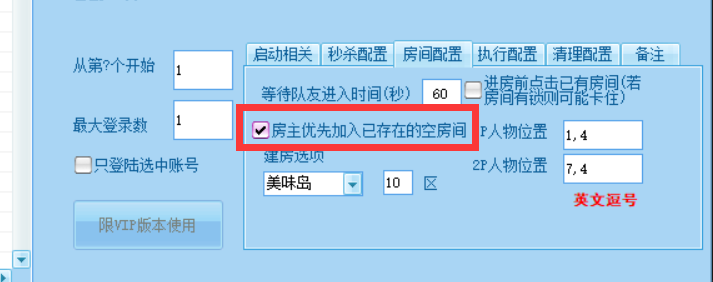
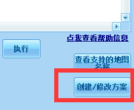
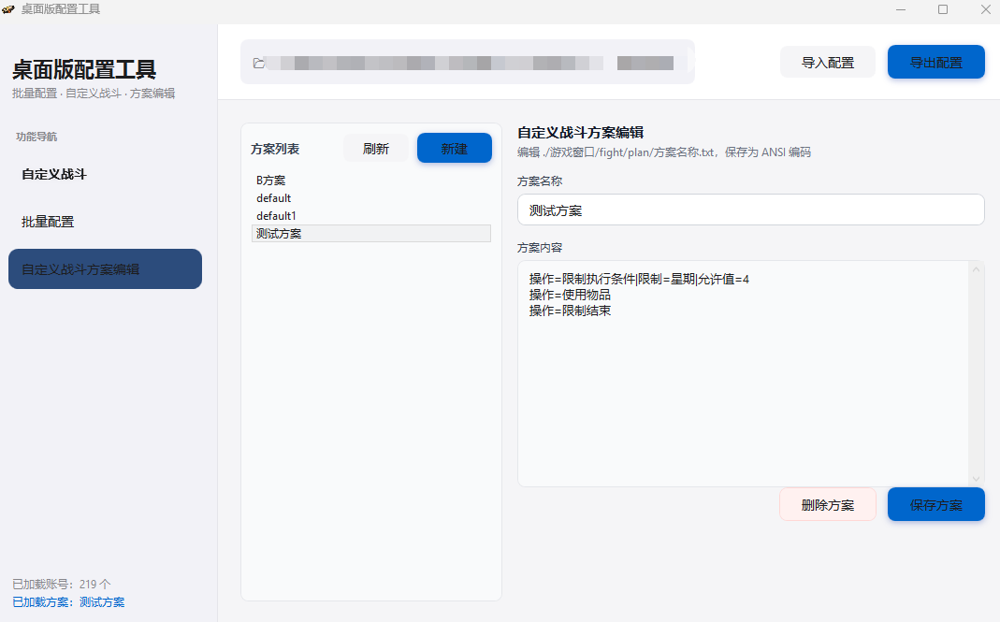

# 自定义战斗序列

<!-- ::: info
该功能在0.96.3起支持
:::

::: warning
当前版本的版本的自动战斗,存在一个BUG,可能导致无法组队(两个人单独开房).

需要到 自动公会任务界面勾选  即可 (当然也可以自定义挂机岛屿以及区)

如果这个方法会让你卡在加入房间,那就取消勾选上面的这项,然后在二号玩家的游戏窗口的公会任务界面取消勾选"我是房主号",即可.

这个问题将在0.96.4修复.
::: -->


自定义战斗序列适用于自动刷一连串的不同地图,方便地完成日常刷图、悬赏、美食大赛等需要连续挑战不同地图的场景，无需坚守在电脑前手动切换地图。

## 配置

每一行格式如下 (不需要加左侧数字):

房主号:

```
仅双人=真
房主=真
地图=美味悬赏|秒杀=3000|次数=1|boss=真
地图=火山悬赏|秒杀=3000|次数=1|boss=真
地图=浮空悬赏|秒杀=3000|次数=1|boss=真
地图=星际悬赏|秒杀=3000|次数=1|boss=真
地图=茴香竹筏（日）|秒杀=0|次数=40|boss=真
仅双人=假
房主=真
地图=机械鲨鱼鼠|秒杀=0|次数=12|boss=真
地图=水晶宫（精英）|秒杀=0|次数=3|boss=真
```

成员号:

```
仅双人=真
房主=假
地图=美味悬赏|秒杀=3000|次数=1|boss=真
地图=火山悬赏|秒杀=3000|次数=1|boss=真
地图=浮空悬赏|秒杀=3000|次数=1|boss=真
地图=星际悬赏|秒杀=3000|次数=1|boss=真
地图=茴香竹筏（日）|秒杀=0|次数=40|boss=真
仅双人=假
房主=真
地图=机械鲨鱼鼠|秒杀=0|次数=12|boss=真
地图=水晶宫（精英）|秒杀=0|次数=3|boss=真
```

这段文本复制到记事本, 再从记事本里复制到对应位置, 一般就可以正常运行了

**在两个号分开各自打的时候, 成员号需要插入一条 房主=真, 让成员号自己开房, 否则会等待其他人创建房间**

除了美食里的地图名称,还支持以下额外的地图名称:

1. 美味悬赏
2. 火山悬赏
3. 浮空悬赏
4. 星际悬赏
5. 智能选择(后续将修复无法选择该地图的问题)

地图名称需严格与游戏的地图名字相同,否则无法正常执行

**直接创建那个关卡,从房间内复制关卡的名字也是可以的,这样方便快捷**

自0.96.8起,自定义战斗支持挂机魔塔. 从房间内复制关卡的名字即可

## 注释

想临时注释某些行, 直接在对应行开头加 ; 或 // 即可

### 修改自定义战斗跳转的岛屿

目前只支持 在桌面版主程序->进阶功能->自挂功能->自动公会任务 界面 右下角, 房间配置 选项卡可以设置相关配置.

未来将会加入到游戏窗口中

### 挂机相关配置

以下的加在地图=xxx| 后, 如 `地图=xxx|次数=1|boss=真|秒杀=0|猫猫大法=真|延迟波次=6` 表示使用猫猫大法, 延迟6波后开始0秒秒杀

|名称| 示例 | 说明 | 
|:-------:|:-------:|:-------:|
|秒杀| 秒杀=3000 | 设定秒杀间隔为3000毫秒 |
|翻牌| 翻牌=3 | 设定翻牌数量为3, 不设置默认为2 (自0.96.8.9起支持) |
|卡组| 卡组=3 | 设定选择第3个卡组, 不设置默认为1, 若设置为0, 则不选择任何卡组, 选择背包中的前两张卡片 (自0.96.9.30起支持) |
|放卡| 放卡=真 | 选择 脚本放卡 而不秒杀|
|猫猫大法| 猫猫大法=真 | 选择 开启猫猫大法 而不秒杀 (自0.96.9.0起支持)|
|延迟波次| 延迟波次=6 | 不秒杀,延迟波次为6后开启秒杀 (配合放卡或猫猫大法使用, 否则无效)|
|延迟秒数| 延迟秒数=300 | 不秒杀,延迟秒数为300后开启秒杀  (配合放卡或猫猫大法使用, 否则无效)|
|漫天火苗| 漫天火苗=5 | 选择 漫天火苗, 设置数字代表漫天火苗持续的秒数 (自0.96.9.0起支持)|
|浮空秒杀开关秒数| 浮空秒杀开关秒数=300 | 设置多少秒后开关浮空秒杀, 这样用于那些特殊BOSS种类较多的关卡, 一次可能无法秒杀所有BOSS, 需要重新开关方可秒杀. (自0.96.9.3版本起支持)|

以下的建议单开一行设置, 更清晰

|名称| 示例 | 说明 | 
|:-------:|:-------:|:-------:|
|仅双人| 仅双人=真 | 设置仅双人时开始游戏, 不填时默认不限制 |
|房主| 房主=真 | 动态调整当前账号是否为房主,假如说战斗序列里有只能单人完成的关卡比如水晶宫,这时候就可以设置 房主=真 , 让这个账号成为房主而不是加入其他人的房间 |


## 自定义操作序列

根据ISSUE反馈, 你可以像添加挂机序列那样, 插入操作序列,解放双手

如:
```
操作=使用双爆
操作=爆率徽章
地图=茴香竹筏（日）|秒杀=0|次数=40|boss=真
```

|名称| 说明 | 
|:-------:|:-------:|
|签到| 由于界面加载慢, 建议执行两遍 操作=签到 避免漏签, VIP签到同理 (需至少是0.96.8.11以上版本的桌面版)|
|使用物品| 若未启用高级功能, 则执行使用十三香礼包, 否则使用高级功能中的"使用物品选项" (需至少是0.96.8.11以上版本的桌面版)|
|VIP签到| (需至少是0.96.8.11以上版本的桌面版)|
|使用双爆| 自动使用两张双爆卡 |
|清理背包| 清理背包物品,暂时只能清理指定的垃圾物品,暂不支持自定义 |
|爆率徽章| 需要提前开启WPE, 之后脚本会自动勾选套装并启用爆率徽章 |
|兑换背包| 自动在假期特惠兑换背包|
|分解宝石| 分解背包内的一部分0星不绑宝石|
|每日任务| 领取每日任务奖励|
|领取悬赏| 领取悬赏奖励|
|领取探险营地奖励| 领取探险营地奖励|
|领取美食大赛奖励| 领取美食大赛奖励|
|领取大富翁| 领取大富翁奖励|
|公会任务| 执行公会任务并领取奖励|
|系统命令| 执行系统命令(需至少是0.96.8.6以上版本的桌面版), 如: 操作=系统命令\|命令=shutdown -s -t 1 (表示执行关机指令)|
|绑定温馨礼包| 操作=绑定温馨礼包 即可,无需其他参数 自动绑定后, 领取链接的末尾是对应游戏的账号_区服号码 如: account_29 (需至少是0.96.9.0以上版本的桌面版)|
|领取温馨礼包| 自动领取温馨礼包, 若你已在温馨礼包.txt中填入,则无需本条命令, 本命令仅用于自动领取那些通过 操作=绑定温馨礼包 自动绑定得到的账号的温馨礼包. (需至少是0.96.9.0以上版本的桌面版)|
|退出游戏| (需至少是0.96.8.11以上版本的桌面版)|

### 操作序列兑换假期特惠

自0.96.9.17起支持:

2026年4月18日10:31:19 修正

<!-- 2026年4月18日10:32:40 -->
<!-- 这里需要注意Markdown \- 会被转义成 -,  如果是\- 需要写 \\- 才可以 -->

|名称| 说明 | 
|:-------:|:-------:|
|~~操作=假期特惠兑换\|类型=1\|flag=6bd530,-256\-22\fdfdd9,-210\5\ffffb2,-156\-5\ef8c43~~  <br> 操作=假期特惠兑换\|类型=1\|flag=6bd530,-256\\-22\fdfdd9,-210\5\ffffb2,-156\\-5\ef8c43| 兑换月签到奖励(25签到道具+1星星之火 兑换签到礼包)|
|~~操作=假期特惠兑换\|类型=1\|flag=68d830,-201\-5\ed8d43,-148\-3\ef8c43,-52\-5\abd6cd~~ <br> 操作=假期特惠兑换\|类型=1\|flag=68d830,-201\\-5\ed8d43,-148\\-3\ef8c43,-52\\-5\abd6cd| 兑换公会活跃礼包奖励(20星星之火兑换有8个转转券的礼包)| 兑换公会活跃礼包奖励(20星星之火兑换有8个转转券的礼包)|


以下操作**必须[启用高级功能](./advanced.md#启用)** 才有效, 如无特别说明, 则至少需是0.96.9.5以上版本的桌面版. 请通过背包物品是否变化, 而非是否跳转相关界面, 来判断是否执行成功.

|名称| 说明 | 
|:-------:|:-------:|
|操作=礼券购买物品\|物品名称=樱桃\|数量=2|礼券购买对应物品, 默认购买间隔是200毫秒, 可以通过 `\|间隔=300` 这样来指定间隔 |
|操作=许愿池\|轮数=2| 快速完成许愿池批量抽奖, 无需手动操作|
|操作=使用指定物品\|物品名称=5000金币| 使用1个指定的物品|

## 条件执行

(自0.96.9.23版本起支持)

只在满足条件的时候执行某些操作, 请看下列示例

```
操作=限制执行条件|限制=星期|允许值=4,5,6
操作=签到
操作=执行自定义方案|方案名称=测试方案
地图=xxx
操作=限制结束

操作=限制执行条件|限制=日期|允许值=25,26
操作=兑换背包
操作=限制结束
```

## 自定义方案

(自0.96.9.23版本起支持)

`操作=执行自定义方案|方案名称=测试方案`





## 批量自动化-自定义战斗

[目前只支持批量自动签到时执行自定义战斗](/docs/guide/auto_sign.md) ,如果你有好的建议,[欢迎反馈](https://report.rainysnow.com)

### 批量配置自定义战斗

如果是新版本, 在桌面版主程序中间 点击, "打开配置工具" , 如果是旧版本桌面版, 请[下载桌面版配置工具](https://rainyy.lanzoul.com/b00eggc9va) (访问密码2333) 以后, 打开, 选择软件根目录,

在自定义战斗配置区域填入相关自定义战斗方案

然后到 "批量配置" 界面

"配置名称" 填入：自定义战斗_一键签到时执行

"值" 填入：真

即可.

## 未来计划

未来计划支持更多操作

同样欢迎反馈建议

## 遇到问题?

### 无法继续战斗?

如果你确定已经设置了 boss=真 但还是无法战斗

你可以把那段文本复制到记事本, 保证格式正确无误以后再粘贴回去即可.

### 悬赏进入的是旧地图

如果你在周四更新新地图后没有重启过桌面版,需要重启桌面版以获取最新地图信息

如果仍然进入旧地图, 你可以到官网下载最新版本.