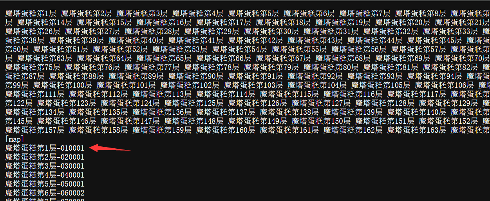
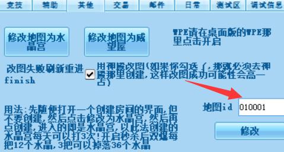

# 挂机魔塔

挂机魔塔方法(版本需0.96.8以上)

## 修改地图法

1. 点击游戏窗口的"其他"选项卡,进入修改地图页面
2. 查看你要挂机的魔塔的地图ID,[点我查看](https://raw.gitcode.com/rainysnow/msdzls-desktop/raw/main/ini/map2.ini)
例如,魔塔第一层

3. 打开创建房间界面,然后输入ID,修改,然后进入房间,即可.此时可以使用一键挂机来挂机魔塔指定层数,打完不会退出房间

:::tip
修改完进入房间后,地图图标可能不会发生变化,但是你开始游戏后是会正常进入魔塔的
:::

## 自定义战斗法

地图名称填写:魔塔蛋糕第1层 即可(必须是阿拉伯数字)

[详见](./auto_fight_list.md)
