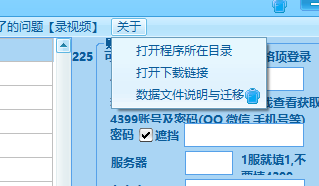
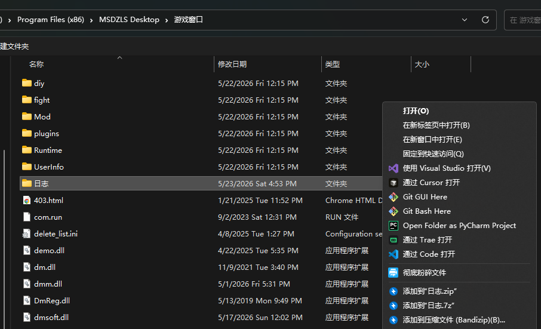
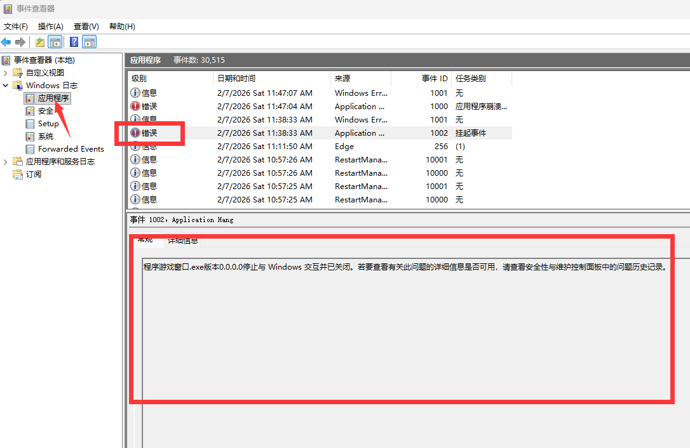

# 新功能申请 BUG反馈

<!-- **翻到页面最底部评论区，可以发表你期望的新功能或者给某评论点赞，后续更新功能将会参考** -->

## 方式0.向管理员说明BUG并提交日志

1. 选择打开程序所在目录

2. 在文件夹中, 找到 `游戏窗口` 文件夹并进入, 找到 `日志` 文件夹, 右键, 压缩为压缩包, 发送给管理员

3. 若为程序崩溃/闪退类问题, 请 先按 win + s, 输入 事件查看器, 打开

将上图内的 `错误` 类的信息发送给管理员, 只需要看最近几条有没有就可以了, 若没有, 则说明不是此类问题.

4. 发送遇到的问题时的截图, 以及对应的游戏账号(不需要密码)

## 方式1.在线反馈（建议）

[反馈页](https://gitcode.com/rainysnow/msdzls-desktop/issues)

进入该页面点击➕号，创建新的issue

标签（label）选择 bug，可以反馈遇到的bug

标签（label）选择 feature,可以提交新功能申请

建议使用此种方式反馈，汇总方便解决，聊天记录太散。

issue反馈的**标题 应当尽可能简洁精确**地描述你遇到的问题或你的诉求. 内容尽可能详细，附带你的联系方式。

如果你在提交一份BUG反馈,内容应当包含:
1. 问题描述,该问题发生的操作，能否100%复现
2. 你期望的修正、解决方法

## 方式2.邮件反馈

发送邮件至 cs.lzh@qq.com,附以详细说明/视频

## 参考格式

问题简述:
问题发生时间:
问题详细描述:
QQ:

如果不是复现困难的BUG都建议你附带录制视频,以便快速定位问题.