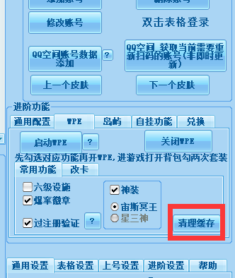
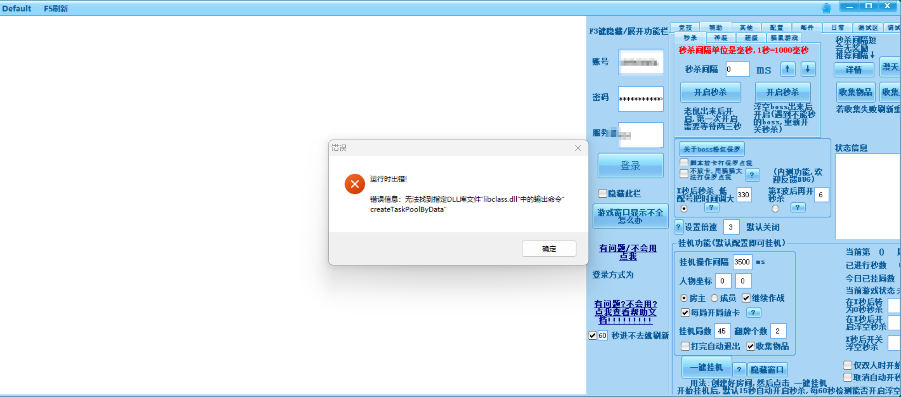

## 可以启动游戏窗口,但无法进入游戏

## 游戏卡进度条97%

清理缓存即可

## 游戏卡进度条100%

1. 可能是服务器很卡,常见于1服等人多的服.换人少的时间段再试.

2. 可能是网络问题,看看你是不是开了代理(vpn),或者换手机流量如果能进就是网络问题. 常见于校园网导致卡100%

## 窗口打开后秒退(可以看到窗口一闪而过)

先尝试把电脑后台程序退干净, 然后再尝试看能否打开?

可能与某些程序冲突, 尝试退干净后台再启动游戏

### 窗口白屏

**如果用流量能进, 就是你校园网的问题**

请再确保一遍账号密码填写没有问题

### 窗口蓝绿色屏

<!--  -->

请去安装Flash,下载方式在桌面版主程序上方菜单栏(不要只下载那个Flash安装包却不安装)

## 窗口绑定失败,游戏成功进入了但是过一会就刷新了

 若是win7, 请在桌面, 右键, 个性化, 主题选择 basic, 而不能是 Aero 主题

重装系统(不要选择win server)

## 弹窗报错缺少 "libclass.dll"

目前未知问题, 只能操作系统解决 (若不是 `libclass.dll` , 请不要参考本内容)