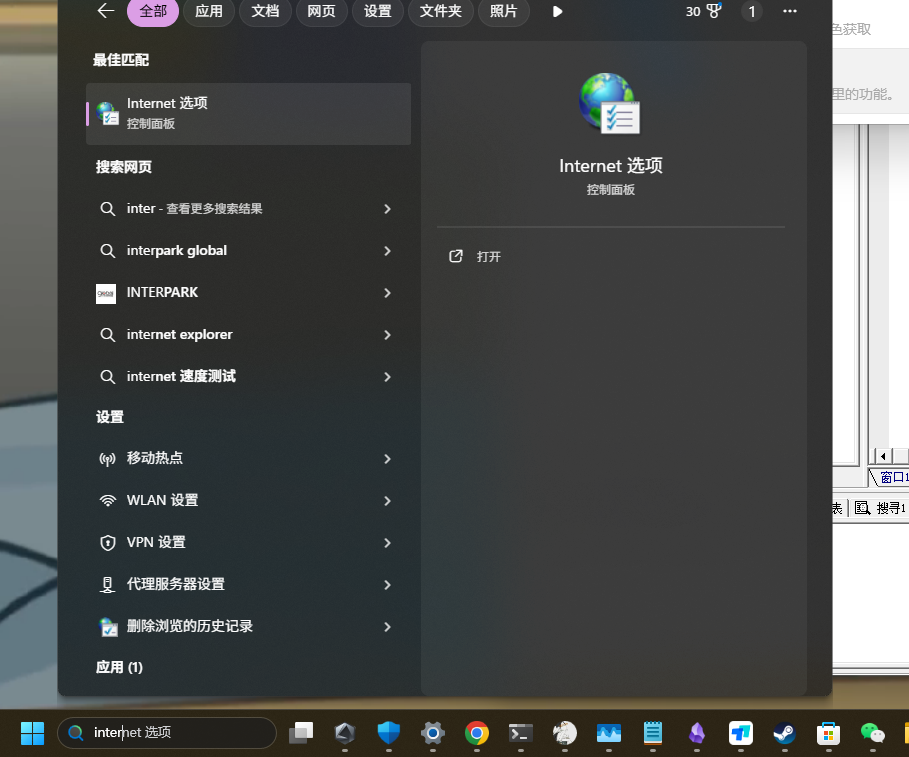

## 双击启动游戏后无任何反应

1. 先确认电脑的internet选项中已开启 SSL 和 TLS   (最新版本默认自动开启此项,无需手动配置)

::: details 点我查看操作步骤

解决方法,按win + s,输入Internet

然后打开TLS即可(若还不行就把1.3也打开).

**win7系统记得开启 SSL2.0**

:::

2. 若已开启 tls 和 ssl

多半是杀毒软件把你游戏窗口.exe杀了,请将软件添加至信任区

[添加软件到信任区 点我查看操作视频](https://www.bilibili.com/video/BV1vz4y1U7Pm)

[不想那么麻烦,想直接永久关闭杀毒软件? 点我查看操作视频](https://www.bilibili.com/video/BV15v4y1X7kw)

当账号密码填写不正确时,也可能会长时间无反应