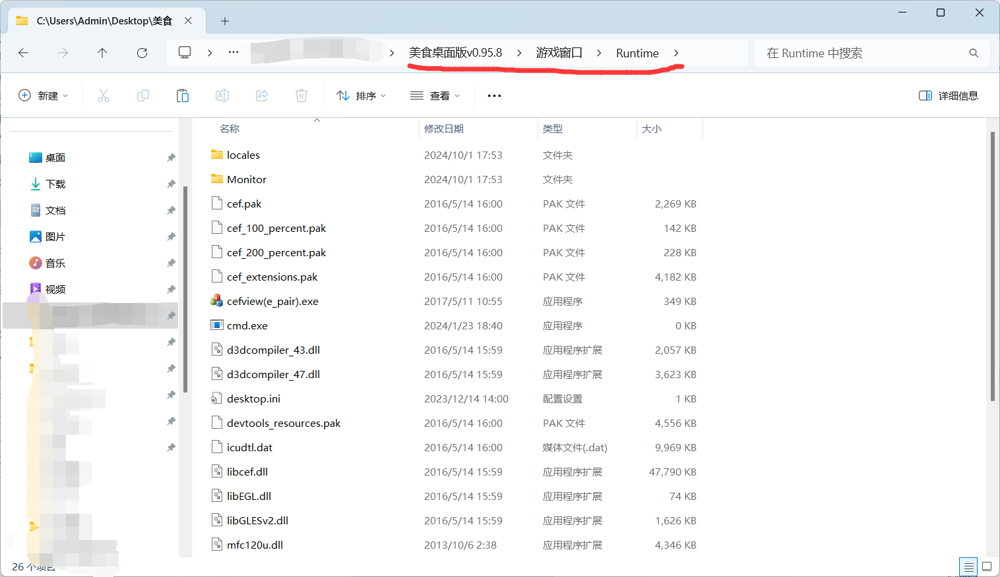

# 正式开始安装

**干的漂亮,善于查文档的你,超越了90%的人!预祝问题顺利解决**

你可以点击上方标题右侧的按钮快速浏览标题。也可以使用ctrl+f输入关键字快速定位到相关问题

> Free版限制批量登录，需要登录更多账号的代肝、自挂用户请查看[VIP版本](/docs/vip/)的相关信息

> 大部分问题本文章都有解决方案.如果你仍然不能够解决,可以在 **软件交流群 560363912** 向群友提问,提问时请**有礼貌地**详细说明你的问题,最好是附带操作过程的视频

[查看软件使用视频](https://www.bilibili.com/video/BV1rC4y1R7GW/)

## 杀毒

如果电脑经常使用外挂之类的第三方软件,强烈推荐**使用火绒杀毒软件查杀清理病毒**,否则可能会导致本软件无法正常启动,游戏无法进入,类似的案例我见了很多例.火绒的杀毒策略更加合理.

## 快速上手. 下载→安装→使用

### 所有你可能需要用到的工具汇总

[点我下载桌面版](https://rainy.lanzoul.com/b048nro4b) 提取码2333

[点我下载纯净Flash](https://rainyy.lanzoul.com/ixPci1ictx6f) 提取码2333

[点我下载游戏环境(Runtime)](https://rainyy.lanzoul.com/iTsTi1lzg0qf) 提取码2333

[点我下载强卡器](https://rainyy.lanzoul.com/b00efpw8vc) 提取码2333

### 蓝奏云链接打不开？

为移动/联通/电信运营商恶意拦截dns导致。请把电脑dns修改为8.8.8.8或8.8.4.4或其他

### 程序目录结构

```

│  美食大战老鼠桌面版.exe

│  账号密码.ini

│

└─游戏窗口

    │

    └─Runtime

```

<!--  -->



### 打开桌面版后发现无法上网

没有考虑到部分地区ping不通114.114.114.114,在检测不到游戏环境时，会自动修改DNS,给部分用户造成了无法上网的困扰

你可以直接下载带 Runtime 的桌面版,这样就不会自动下载,从而不会修改你电脑的DNS

后续版本将解决该问题

### 检测不到游戏环境解决办法

若你游戏窗口文件夹**(并非桌面版根目录,而是桌面版根目录下的"游戏窗口"子文件夹)**内没有Runtime文件夹,请:

1. 自己在游戏窗口文件夹内新建Runtime文件夹

2. 下载Runtime压缩包,[链接](https://wwp.lanzoul.com/iTsTi1lzg0qf),提取码2333,将压缩包内的文件解压到刚才创建的Runtime文件夹(注意解压时不要再弄一个新的Runtime文件夹)

3. 重启软件

**如果你实在不会操作,就去 https://msdzls.sumk.top 里下载带Runtime的桌面版.只是不保证最新**

## 登录游戏

## 4399玩家登录

正常来说,在主程序左侧表格键入4399账号,密码,区服,角色名后即可正常打开游戏

区服填写纯数字

::: warning
任何信息都不要带空格,否则会扰乱参数解析,导致异常行为
密码中不要包含可能扰乱URL解析的字符(如 % / *)
:::

### 第三方登录4399

::: details 点我查看如何获取4399账号密码
先在浏览器登录4399,去到个人中心,查看用户名(一串数字,即为4399账号),然后去修改密码,即为4399密码
:::

~~再次声明,本软件目前仅支持4399美食,不支持QQ空间,7K7K等平台~~

本软件于2025.8.5起支持4399美食, QQ空间,3366 美食大战老鼠

## QQ空间 3366 玩家登录

1. 打开桌面版,点击右上方的 "QQ空间添加账号数据"

2. 在新弹出来的窗口中,登录QQ空间,进入到选服页面后,不要进入游戏.在下方填入QQ账号,然后按保存账号信息

3. 回到桌面版,在表格中输入:

账号:QQ账号

密码:(**这里不要填QQ密码,QQ空间玩家填QQ空间,3366玩家填3366**)

服务器:输入服务器号码对应的数字

## 软件更新方式

下载新版压缩包后覆盖原路径文件即可，数据均保留

## 软件被杀毒软件删除

可以在Windows 安全中心 以及你自己的杀毒软件中,**添加排除项**,将软件所在文件夹添加进去即可.具体方法请自行百度或问群友.

## 乱码

### 打开软件,界面乱码,或有乱码报错

解决方法: https://bm.sumk.top

繁体字特区的用户,系统可能不支持GB2312编码,~~因此无法解决,考虑使用虚拟机.~~软件最新版本在繁体系统上设置系统语言为简体中文后可以正常显示,如仍然显示不正常,可以联系群内管理员帮助解决.

### 软件界面显示正常,但是输入中文会显示问号或乱码

卸载美式键盘这个输入法

如果还不可以,则卸载微软拼音输入法,保留搜狗拼音输入法


## 其他补充

账号,密码,区服,角色名 任何字段都不要带空格,角色名不要空着,否则会出问题

## 功能计划/预告/调整

~~公会任务更丰富的自定义配置(顺序,跳过,前置关)~~ (已完成)
自动假期特惠兑换
WPE通关之王
批量操作结束后通知到指定QQ (vip)
WPE代码重写,修复频繁掉线问题
日常-勇士-水晶宫-遗迹
批量挂机丰富自定义配置


### 捐助致谢

醉雨听月 

