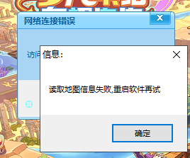
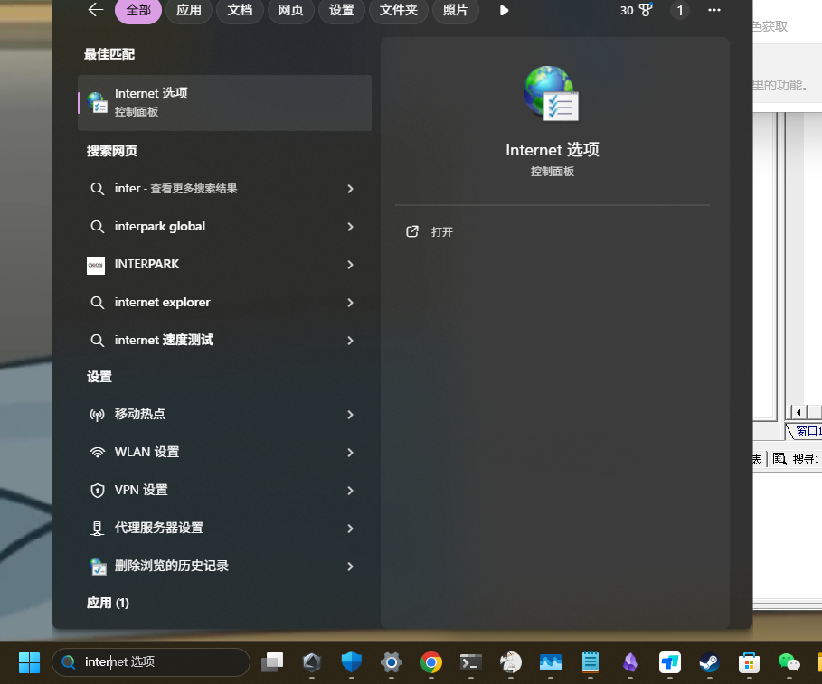
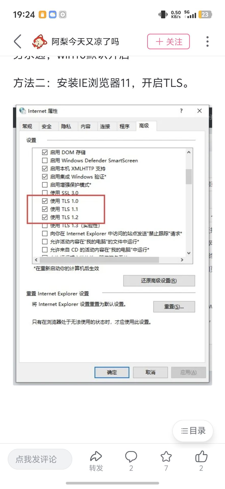
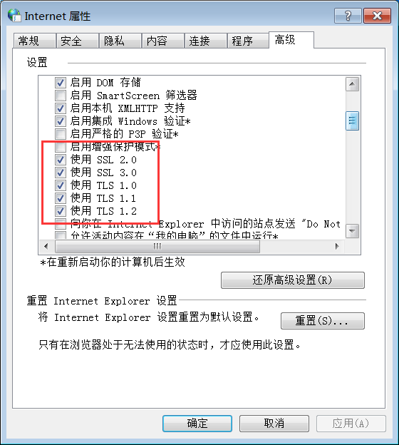

# 打不开软件?

## 提示包含病毒或潜在的垃圾软件

去Windows安全中心关闭 **实时保护**

## 提示网络连接错误/读取地图信息失败/下载配置项失败

::: details 点我查看解决办法

解决方法,按win + s,输入Internet

然后打开所有SSL和TLS即可(若还不行就把1.3也打开).

**win7系统记得开启 SSL2.0**

:::

## 启动桌面版主程序无任何反应

::: details 最新版本默认无需配置此项! 点我查看解决办法

[关闭DEP数据执行保护(选择**仅为基本Windows程序和服务启用DEP**) 点我查看操作步骤](https://blog.csdn.net/qq_34920482/article/details/153631225).

右键以管理员身份运行程序.

:::

## 软件乱码弹窗?

[点我查看解决方法](./introduce.md#乱码)

## 软件被杀毒软件删除 / 提示无法找到指定dll文件的xxx命令

**【强烈建议配置此项】一劳永逸!!!**

[添加软件到信任区 点我查看操作视频](https://www.bilibili.com/video/BV1vz4y1U7Pm)

[不想那么麻烦,想直接永久关闭杀毒软件? 点我查看操作视频](https://www.bilibili.com/video/BV15v4y1X7kw)

可以在Windows 安全中心 以及你自己的杀毒软件中,**添加排除项**,将软件所在文件夹(也可以添加一整个盘符,更省心)添加进去即可.具体方法请自行百度或问群友.

然后重新解压软件