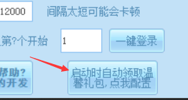

# 批量领取温馨礼包

## 方法

桌面版主程序右下角,进入后,按照提示,将温馨礼包链接粘贴进去就行.

上面说的很明白了,一行一个链接,不要附带任何其他无关内容,别自己加任何无关字符

**tips: 可以和熟人互相填入对方的温馨礼包链接,这样你们可以互相帮忙领取,不用怕哪天忘了开电脑导致少领.**

## 如何给小号绑定温馨礼包(无视微信号数量限制,给任意多个小号绑定!)

注意看下面的链接

http://meishi.wechat.123u.com/meishi/index?openid=

只需要在最后加入数字或字母的组合即可(推荐写你的账号,这样方便记忆)

**tips:有人说这里看不懂. 意思就是这个网址后面可以随便输一些东西,然后你打开这个网址就是一个新的温馨礼包绑定界面, 为什么推荐写你的4399账号呢? 方便记忆, 不然以后链接丢了就找不回来了**

然后通过浏览器访问,即可正常打开温馨礼包界面,你完成温馨礼包的绑定后,将该链接填入桌面版自动领取的地方即可

## 关于自动绑定温馨礼包/自动开温馨礼包/自动开双爆

1. 自动绑定温馨礼包

敬请期待

2. 自动开温馨礼包

在批量日常勾选开十三香礼包,会把所有类似的礼包(包括温馨礼包)自动开启

3. 自动开双爆

见批量自动挂机