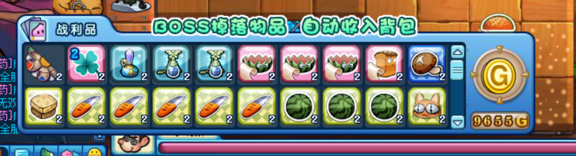
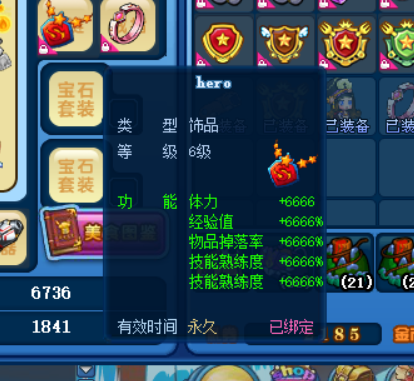

# WPE

## WPE神装使用方法(其余类似)

[b站视频教程](https://www.bilibili.com/video/BV1pJtbzgEVp/)

## 有何作用?

1. 可以开启全六级公会设施,可用于买6级商城内的物品
2. 大幅度的爆率加成(6666%只是好看,爆率上限为100%左右)
3. 神装,可以用于打带粉红保罗的无法直接秒杀的关卡(保证更新到0.96.1)
4. 改卡(调整改卡配置后,必须重启WPE并清理缓存. 卡在99% 说明名字打错了)

### 关于爆率加成的说明

很多人认为爆率加成无用,这是错误的观点.只是因为爆率的上限是100%.

下面以低配账号进行测试对比,结果如下:

开启前:

开启后

## 使用方法

先打开WPE,然后去背包勾选左侧的套装,如果开启成功,会得到一个爆率徽章Hero(在背包内,需要你自己装上),以及6级公会设施

:::warning
WPE刷出来的武器宝石,只能是佩戴你本来就有的武器,不能佩戴它新刷出来的武器,否则你开始游戏就会被踢出房间.
:::

## WPE启动失败?

一般是win7系统会出现, 目前暂不支持. 建议尽快升级到win10以上

## WPE开启后,点击背包套装无反应

## 1. 检查任务管理器里是否有WPE进程(图标为冥王战镰)?

若没有,则你先把软件更新到最新后再试.

## 2. 任务管理器里存在WPE进程

确保你已经在WPE处勾选了 "六级设施" 或 "爆率徽章" 等你需要开启的内容, 尝试重启WPE看看有没有效果

## 3. 重启WPE也没效果

可能是驱动加载失败,可能只能重装系统解决.

## 自定义游戏音乐

厌倦了游戏大厅的BGM,想听自己喜欢的歌曲?

请前往 游戏窗口 文件夹下的 diy 文件夹内的 sound 文件夹

准备好你的音乐文件,根据下面不同的分类,将文件改成对应的名字放进去.

最后,清理缓存,重进游戏即可

常用BGM如下,会找相关音乐名称的也可以自己自定义更多,远不止这些..

| 场景 | 文件名称(若前面有斜杠,意味着要创建对应文件夹) |
|-------|-------|
| 大厅 | chengzhen_01.mp3 |
| 游戏房间准备 | dengdai_02.mp3 |
| 游戏胜利 | /interface/shengli_08.mp3 |
| 游戏失败 | /interface/shibai_09.mp3 |
| 火苗拾取 | /interface/huomiao_17.mp3 |
| 美味岛战斗 | /backgound/zhandou_b_03.mp3 |

